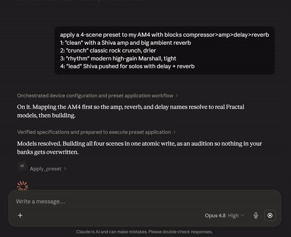

# MCP MIDI Control

[](https://github.com/TheAndrewStaker/mcp-midi-control/actions/workflows/preflight.yml)
[](./LICENSE)

**An opinionated MCP server for controlling your MIDI gear by conversation.**

MCP MIDI Control is a local [Model Context Protocol](https://modelcontextprotocol.io)
(MCP) server that lets Claude, or any MCP host, control your MIDI gear by
conversation. You say what you want in plain language; the server speaks
SysEx, NRPN, and CC to the hardware over USB and reads it back to confirm.

It holds a set of strict opinions on **every** device, so the same
instruction and the same guarantees behave the same way whether you are
talking to a guitar modeler or a synth:

- **Display-first.** You pass and read the values on the front panel (a
  0 to 10 knob, dB, ms, a ratio, an enum name), never raw wire bytes or
  internal indices.
- **Nothing destructive happens silently.** It does not save, overwrite,
  or navigate away from your edits unless you say so, and every write
  waits for the device to acknowledge it before reporting success.
- **Tempo-first when the device supports it.** Time-based settings prefer
  syncing to the song tempo, so a dotted-eighth delay stays a
  dotted-eighth delay.

Generic-MIDI primitives (CC, NRPN, SysEx, program change, notes, clock)
reach any USB MIDI device the OS exposes, so a Line 6 Helix, a Boss
GT-1000, or any synth with a CC chart works from day one. A few devices
get first-class, hardware-verified depth: whole-preset and patch
authoring, real-gear lineage data, and cross-device tone translation.
Today that tier is the **Fractal AM4**, **Fractal Axe-Fx II XL+**, and
**ASM Hydrasynth Explorer**, with the **Fractal Axe-Fx III** in community
beta. Adding a device is a descriptor, not a new set of tools. Line 6
Helix and other popular modelers, instruments, and synthesizers are the
next targets, and [contributions are open](#contributing).



> **Unaffiliated community tool.** "Fractal Audio", "AM4", "Axe-Fx",
> "Axe-Fx II", "Axe-Fx III", "FM3", "FM9", "ASM", "Hydrasynth", and
> related product names are trademarks of their respective owners
> (Fractal Audio Systems, Inc. and Ashun Sound Machines). This project
> neither claims endorsement from, nor affiliation with, those
> manufacturers. It communicates with hardware the user already owns
> via SysEx / NRPN / CC messages, using publicly-documented protocol
> information (including Fractal Audio's own "MIDI for Third-Party
> Devices" specifications). See [`NOTICE`](./NOTICE) for the full
> trademark statement.

---

## Status

First public release. The opinions above are enforced the same way on
every device, and the protocol layer is hardware-verified on the
first-class tier (Fractal AM4, Axe-Fx II XL+, ASM Hydrasynth Explorer),
with every wire-level tool backed by byte-exact goldens against real
captures. Whole-preset and whole-patch authoring is audio-confirmed end
to end: a guitar preset (compressor, amp, cab, reverb, multiple scenes)
or a synth patch (oscillators, filter, envelopes, mod matrix) builds in
one conversational turn, and `apply_preset`'s `verify_chain` flag reads
back every written param to confirm the device matches intent.
`translate_preset` ports a tone across the first-class guitar devices by
mapping block roles, translating param vocabularies, and collapsing
channel and scene cardinality.

Generic-MIDI primitives reach any other USB MIDI device today. The
Axe-Fx III is in community beta; see [Axe-Fx III status](#axe-fx-iii-status)
below if you own one.

<!-- tool-inventory:generated:start -->

**38 MCP tools registered.** Unified surface for tone-building across all supported devices, plus generic-MIDI primitives and device-specific extensions.

Full tool list with description-length stats: [`docs/TOOLS.md`](docs/TOOLS.md). Generated by `npm run tools:inventory`; preflight checks for drift.

<!-- tool-inventory:generated:end -->

> **Your presets and patches stay safe.** Every save is gated behind
> explicit user save-intent language; the server refuses silent saves and
> warns before navigating away from edited buffers. Use `switch_preset`
> to reload a stored preset over an edited working buffer. See
> [`docs/SAFETY-FOR-MUSICIANS.md`](docs/SAFETY-FOR-MUSICIANS.md) for
> the trust model in plain English.

Distribution is a Windows ZIP that bundles a Node runtime plus the
server. No Node or developer tooling required.

---

## A 30-second demo

One example, on a guitar modeler. Plug in an AM4, relaunch Claude Desktop
with this server connected, then:

> **You:** Build me a Vox-AC30-platform clean on Z04 with mild break-up, slow tremolo, and a plate reverb sitting behind a lead scene. Don't save yet, just let me audition.
>
> **Claude:** *Calls `describe_device({port:'am4'})` to pull the AM4's block and enum vocabulary, calls `lookup_lineage` to get the AC30 master sweet-spot, then applies a 4-block preset with scene 1 "Verse", scene 2 "Solo", drive engaged on scene 2, and reverb mix at 28%. Returns a one-paragraph summary of what landed.*
>
> **You:** Now port that to my Axe-Fx II at location 614.
>
> **Claude:** *Calls `translate_preset` to rewrite the spec for the II (drive.level to drive.volume, "USA Pre Clean" to "USA CLEAN", channel A to channel X), then `apply_preset` at location 614 so you can audition the same tone on a different amp.*

The same kind of request works on a synth. "Give me an OB-Xa-style brass
on the Hydrasynth with the mod wheel opening the filter" has Claude apply
a patch and wire the mod matrix by name, so the voice actually moves. Each
exchange is one chat turn. No JSON, no menu navigation, no editor.

---

## What you can ask Claude to do today

Once connected, Claude can:

- **Build a full preset or patch in one sentence.** *"Build me a clean
  preset with a compressor, a Deluxe Verb Normal amp at gain 4 and bass 6,
  a 350 ms analog delay, and a Deluxe spring reverb at 35% mix."*
- **Build an expressive synth voice.** *"Make a warm OB-Xa-style brass and
  have the mod wheel open the filter."* On a synth the server wires the
  mod matrix and macros by name, not just static knobs.
- **Tweak individual params.** *"Drop the gain to 3 and bump the reverb
  mix to 50%."* / *"Open the cutoff a touch and lengthen the release."*
- **Place, clear, or change blocks.** *"Put a Klon-style drive in slot 1
  and swap the reverb for a plate."*
- **Name and save.** *"Save this to Z4 and call it 'Clean Machine'."*
- **Manage scenes.** *"Name scene 2 'verse', scene 3 'chorus', scene 4
  'solo'."* / *"Switch to scene 3."*
- **Research tones by real gear.** *"What's the closest drive to a Klon?"*
  / *"Which amp model is inspired by a Matchless DC-30?"*
- **Port a tone across devices.** *"Take my AM4 preset at A1 and rebuild
  it on the Axe-Fx II at location 614."* (`translate_preset` maps block
  roles and param vocabularies across the first-class guitar devices.)
- **Verify the device matches intent.** Pass `verify_chain: true` to
  `apply_preset` and the server reads back every written param,
  reporting any drift before returning success.
- **Start from a named recipe.** Recipes are curated starting points you
  call by `recipe_id` on `apply_preset` (guitar) or `apply_patch` (synth).
  The Hydrasynth ships a real patch library (Prophet-5 pad, Juno-106 pad,
  OB-Xa Jump, and more, most auditioned on hardware); the guitar side ships
  utility effect recipes (pitch, wah, filter, auto-wah, diatonic pitch).
  A per-amp loudness corpus also drives scene-leveling guidance so a "lead"
  scene gets louder than "rhythm" without redlining. Recipes are a living
  library and we want help growing it (see [Contributing](#contributing)).
- **Switch presets.** *"Load A1."*

Under the hood Claude reaches for one of the unified-surface tools
(or a generic-MIDI primitive if the device isn't a registered one)
and sends SysEx, CC, or NRPN to the device. Tool
round-trips land in roughly 30 to 60 ms; whole-preset builds take
under a second.

The unified surface (`set_param`, `get_param`, `apply_preset`,
`translate_preset`, `get_preset`, `switch_preset`, `save_preset`,
`switch_scene`, `set_block`, `set_bypass`, `lookup_lineage`,
`scan_locations`, `describe_device`, ...) works against any registered
device. Pass the `port` argument and the dispatcher routes to the right
device. Voice-class tools (`apply_patch`, `init_patch`, `set_system_param`,
`set_macro`, `set_macro_route`, `set_mod_route`) extend coverage to synths
and patch-based devices, including the mod-matrix and macro wiring that
make a voice expressive. Per-device behavioral guidance (channel/scene
model, applicability rules, iconic-amp tables) lives in
`describe_device(port).agent_guidance`. Call it once per session before
any tone-building work.

Generic-MIDI primitives (`send_cc`, `send_note`, `send_program_change`,
`send_nrpn`, `send_sysex`, ...) work against any USB MIDI device the OS
exposes, not just registered hardware. See [Generic MIDI
primitives](#generic-midi-primitives-13-tools) below.

---

## Requirements

- **Windows 10/11.** macOS / Linux builds are on the roadmap.
- At least one registered MIDI device connected by USB. Currently
  registered: **Fractal AM4** ([USB driver](https://www.fractalaudio.com/am4-downloads/)),
  **Fractal Axe-Fx II XL+** (Q8.02 firmware, hardware-verified),
  **Fractal Axe-Fx III** (🟡 community beta, see Status above),
  **ASM Hydrasynth Explorer** (firmware 1.5.x). Unregistered USB MIDI
  devices still work through the generic-MIDI primitives.
- A Claude client that supports MCP: [Claude Desktop](https://claude.ai/download),
  [Claude Code](https://docs.claude.com/en/docs/claude-code), or any
  other MCP-capable host.
- For source-installs only: Node.js 18+ and Visual Studio Build Tools
  (to compile the `midi` native module, published on npm as `midi`,
  source at [justinlatimer/node-midi](https://github.com/justinlatimer/node-midi)).
  The release ZIP bundles Node so end users do not need either.

Editor apps (AM4-Edit, AxeEdit, Hydrasynth Manager) can stay open
while the MCP server runs; Windows MIDI ports are shareable. If a
tool call doesn't reach the device, see the troubleshooting tips for
port-not-found errors. After install, run `verify-midi.cmd` to
confirm each device is visible to the server.

---

## Axe-Fx III status

The Axe-Fx III protocol layer is scaffolded from Fractal's published "Axe-Fx III MIDI for Third-Party Devices" v1.4 PDF and the AxeEdit III editor assets (full block roster verified against the editor assets). Device identification, `describe_device`, `switch_preset`, and `switch_scene` work today. Write tools (`set_param`, `apply_preset`, `save_preset`) DO send wire bytes: the wire shape is byte-verified against the v1.4 spec + 10 public captures, but unverified end-to-end on real III hardware. Every III tool response carries a `[III BETA, unverified on hardware]` notice so the agent (and you) know the call is hypothesis until someone with a III confirms front-panel behavior.

**III owners: we need your help.** Five 5-minute test sessions per the [community beta-testing guide](./docs/AXEFX3-BETA-TESTING.md) take the III from community-beta to hardware-verified. No capture tools, no Wireshark, no developer setup required: plug in, run a call, paste the JSON response into a GitHub issue.

---

## Install

### From the release ZIP (recommended)

1. Download the `mcp-midi-control` ZIP from [the latest release](https://github.com/TheAndrewStaker/mcp-midi-control/releases/latest).
2. Extract the folder anywhere you like (your home directory, an
   Apps folder, wherever).
3. Make sure Claude Desktop is fully closed (system tray right-click
   → Quit, not just the window's X).
4. Double-click `setup.cmd` inside the extracted folder. A console
   window opens, registers the server with Claude Desktop, and waits
   for a keypress.
5. (Optional but recommended) Double-click `verify-midi.cmd`. It asks
   the OS directly which MIDI devices are visible and reports
   `[OK] Fractal AM4`, `[OK] Fractal Axe-Fx II`, etc., confirming the
   USB / driver side is healthy before you open Claude Desktop. If
   nothing is detected, the script prints driver download links and
   the next thing to try (usually replug the USB cable).
6. Open Claude Desktop. The mcp-midi-control server appears in the
   connector panel (the + button near the chat input).

To uninstall: double-click `uninstall.cmd` to remove the entry from
Claude Desktop's config (any other MCP servers you have stay intact),
then delete the extracted folder.

> **First time using it?** [`docs/GETTING-STARTED.md`](docs/GETTING-STARTED.md)
> walks through 6 day-one conversations with literal prompts to paste,
> expected behavior, and the audition-vs-save vocabulary. Read it
> before you ask Claude to "save" anything. Pair with
> [`docs/SAFETY-FOR-MUSICIANS.md`](docs/SAFETY-FOR-MUSICIANS.md) for
> the full trust model.

> **Note on signing.** This is an unsigned community release, so Windows
> may show a SmartScreen caution the first time you run `setup.cmd`
> (choose "More info" then "Run anyway"). The source is open here on
> GitHub if you want to read every line of the install scripts first.

### From source (for development or contributing)

Clone the repo, install dependencies, and run the hardware smoke test:

```bash
git clone https://github.com/TheAndrewStaker/mcp-midi-control.git
cd mcp-midi-control
npm install
npm run preflight    # typecheck + protocol goldens + MCP smoke test
npm run write-test   # changes amp gain on the device (confirms MIDI path)
```

If `write-test` flips the amp gain on the AM4's display, the hardware
path is good. Then register the server with Claude Desktop in one
command:

```bash
npm run setup-claude-desktop
```

This builds `dist/`, detects whether you have the direct-download or
Microsoft Store variant of Claude Desktop (or both), and writes our
entry into the right `claude_desktop_config.json` without disturbing
other MCP servers you have. Restart Claude Desktop fully (system tray
→ Quit) and the tools appear in the connector panel.

After source changes that touch `src/`, run `npm run setup-claude-
desktop` again (it re-runs the build + re-writes the config) and
restart Claude Desktop. Claude Desktop runs the compiled `dist/`
output, not the TypeScript source, so a rebuild is required for
changes to take effect.

> Windows-only for now. macOS / Linux source installs work (preflight
> + smoke pass cleanly) but the bootstrap script relies on PowerShell.
> Mac / Linux contributors hand-edit `claude_desktop_config.json` per
> [Connect to Claude](#connect-to-claude) Option 1 below.

---

## Connect to Claude

> If you installed from the release ZIP, `setup.cmd` already
> registered the server with Claude Desktop. Skip ahead to
> [Confirm it works](#confirm-it-works); the options below are for
> source installs and non-Claude-Desktop MCP clients.

### Option 1: Claude Desktop (GUI config)

Run `npm run build` first to produce `dist/`. Then edit Claude
Desktop's config and add the entry below.

**Where the config file lives:**

| Claude Desktop variant | Config path |
|---|---|
| Windows (direct download) | `%APPDATA%\Claude\claude_desktop_config.json` |
| Windows (Microsoft Store) | `C:\Users\<you>\AppData\Local\Packages\Claude_pzs8sxrjxfjjc\LocalCache\Roaming\Claude\claude_desktop_config.json` |
| macOS | `~/Library/Application Support/Claude/claude_desktop_config.json` |

If the file doesn't exist, create it. If both Windows variants of
Claude Desktop are installed, edit both files. macOS users replace
the Windows path in the JSON below with their
`packages/server-all/dist/server/index.js` absolute path (e.g.
`/Users/you/code/mcp-midi-control/packages/server-all/dist/server/index.js`)
and use forward slashes.

```json
{
  "mcpServers": {
    "mcp-midi-control": {
      "command": "node",
      "args": ["C:\\path\\to\\mcp-midi-control\\packages\\server-all\\dist\\server\\index.js"],
      "env": {}
    }
  }
}
```

Adjust the path. Fully quit Claude Desktop (system tray → Quit, not
just the window's ✕) and relaunch. The tools appear under the **`+`
button → Connectors** in a new chat.

> The bootstrap script `npm run setup-claude-desktop` automates all
> of this. It runs the build, detects which Claude Desktop variant(s)
> are installed, and writes the config without disturbing other MCP
> servers. Skip this option entirely if you ran that.

> **Why not `npx tsx <src/...>`?** It looks tempting (no build step!)
> but Claude Desktop spawns the MCP server with cwd set to
> `C:\Windows\System32`, so `tsx` can't find the project's workspace
> tsconfigs and intra-package imports fail to resolve. Pointing
> Claude Desktop at the built `packages/server-all/dist/server/index.js`
> sidesteps that: every cross-package import resolves through
> `node_modules` symlinks created by npm workspaces.

### Option 2: Claude Code (CLI)

From your project directory, after `npm run build`:

```bash
claude mcp add mcp-midi-control -- node C:\path\to\mcp-midi-control\packages\server-all\dist\server\index.js
```

Then start `claude` and the tools are available in your session.

### Option 3: Any MCP client (raw stdio)

For development, launch with:

```bash
npm run server   # tsx-based, picks up source changes immediately
```

For wiring into another MCP client (cwd-agnostic):

```bash
node C:\path\to\mcp-midi-control\packages\server-all\dist\server\index.js
```

The server speaks MCP over stdio in either case.

---

## MCP host compatibility

The server implements the open [Model Context Protocol](https://modelcontextprotocol.io)
spec, so it works with any spec-compliant MCP host. The protocol layer
is host-agnostic; only the config file location differs.

| Host | Status | Config location |
|---|---|---|
| **Claude Desktop** (Anthropic) | ✅ Primary target | `claude_desktop_config.json` (per-platform path; `npm run setup-claude-desktop` finds it for you) |
| **Claude Code** (CLI) | ✅ Tested | `claude mcp add` registers it; or `~/.claude.json` |
| **Cursor** | ✅ Spec-compliant, works | `.cursor/mcp.json` (project) or global settings |
| **Windsurf** (Codeium) | ✅ Spec-compliant | `~/.codeium/windsurf/mcp_config.json` |
| **Continue.dev** (VS Code) | ✅ Spec-compliant | `~/.continue/config.json` |
| **VS Code GitHub Copilot Chat** | ✅ Spec-compliant | VS Code settings → `chat.mcp.servers` |
| **Cline / Roo Code** (VS Code) | ✅ Spec-compliant | Extension-specific JSON |
| **LM Studio, Goose, Ollama-based hosts** | ✅ Most support MCP | Per-host config |
| **ChatGPT Desktop** (OpenAI) | 🟡 Partial. MCP support added 2025; tool descriptions on this project are large (~10 KB), may hit description-length limits in some surfaces | OS-specific |
| **Microsoft Copilot Studio** | 🟡 Better for cloud-hosted MCP servers than local-stdio | Azure-side |
| **Google Gemini first-party** | ⚠️ Native MCP not shipped at the time of writing; Gemini Extensions / function-calling is similar-but-distinct. Adapter layers exist | Adapter-specific |

The JSON shape is near-universal across hosts:

```json
{
  "mcpServers": {
    "mcp-midi-control": {
      "command": "node",
      "args": ["/path/to/packages/server-all/dist/server/index.js"]
    }
  }
}
```

What differs per host: the file location, the top-level key name (some
use `mcpServers`, some `mcp.servers`), and whether they honor `cwd` /
`env` fields (Claude Desktop does not honor `cwd`, which is why we
recommend the absolute-path-to-`dist` setup rather than `tsx` against
source). After editing whichever config your host uses, restart it.

Primary target is Claude Desktop because of how cleanly the
Connectors panel surfaces tool calls, but any spec-compliant host
should work. Hardware features (USB MIDI, the AM4 / Axe-Fx II
drivers) are the same regardless of host.

---

## Confirm it works

1. Open a new chat in your Claude client. Make sure the AM4 is powered
   on and connected by USB.
2. Ask: **"Using mcp-midi-control, list the MIDI ports you can see."**
   Claude calls `list_midi_ports` and reports a verdict like *"AM4
   detected (in: AM4, out: AM4)"*. If it says the AM4 isn't visible,
   replug the USB cable.
3. Ask: **"Place a compressor in slot 1 and set the level to 6."**
   Watch the AM4 display. Slot 1 should flip to Compressor and the
   level knob should jump to 6. Round-trip is under a second.

If step 3 works, you're done. Move on to building full presets.

### Troubleshooting

- **"AM4 not found in MIDI device list":** the server couldn't open
  the USB port. Check the AM4 is powered on, the USB cable is seated,
  and the driver is installed. Power-cycle the AM4 if needed.
- **Tool call hangs in Claude Desktop:** the server writes to MIDI
  synchronously, so hangs usually mean the `midi` native module
  couldn't load. Check Claude Desktop's MCP log for stderr output
  from the server.
- **Parameter out of range:** `set_param` validates against the
  parameter's `displayMin`/`displayMax`. Ranges are derived from the
  AM4's own metadata cache.

---

## The tool surface

The server exposes tools across four families: a **unified surface**
(same name, every registered device), **voice-class** tools for synths,
**generic-MIDI primitives** (any USB MIDI device the OS exposes), and
MIDI utilities. The exact count and the four-family split are generated
from the live server and shown in the [tool inventory](#status) above;
the full per-tool reference is [`docs/TOOLS.md`](docs/TOOLS.md).

> **Cross-device tolerance built in.** The unified surface accepts
> common aliases (`drive.volume` resolves to `drive.level` where the
> device uses that name) and fuzzy enum names (e.g. *"Plexi 100W"* maps
> to whichever exact enum string the target device uses), so the same
> conversational instruction works across AM4 / Axe-Fx II / Axe-Fx III
> without per-device rewording. `translate_preset` leans on both to port a
> tone between devices in one call.

### Unified surface: same name, every device

Pass `port` to select which device (id, display_name, or any MIDI
port-name substring match). Adding a new device means writing a schema
descriptor + wire adapter; no new tools.

| Tool | What it does |
|---|---|
| `describe_device(port)` | Capabilities + canonical vocabulary + block roster. Pure introspection. Call once per session to learn what a device offers. |
| `list_params(port, block?, name?, include_descriptions?)` | Enumerate named params. With `block`+`name` on an enum-typed param, returns the full enum table. `include_descriptions: true` returns the long-form param descriptions for tone-building context. |
| `get_param(port, block, name, channel?, include_description?)` | Single read, returns display-shaped value. `include_description: true` adds the long-form description in the response. |
| `set_param(port, block, name, value, channel?)` | Single write. Display values for numerics ("4.5"); enum names or wire index for enums. Cross-device aliases (e.g. `drive.volume` -> `drive.level`) and fuzzy enum matching are applied automatically. |
| `get_params(port, queries[])` | Batch read. Continues past per-query failures. |
| `set_params(port, ops[])` | Atomic batch write; validates every entry up-front. |
| `set_block(port, slot, block_type)` | Place/clear a block at a slot. |
| `set_bypass(port, block, bypassed)` | Silence/activate a block on the active scene. |
| `get_preset(port)` | Snapshot the active working buffer: every placed block with its current params. Use for state-anchoring before edits. |
| `apply_preset(port, spec, target_location?, verify_chain?)` | Build a whole preset in one call (blocks + params + scenes + name). Without `target_location`, writes to the working buffer only; with it, switches to the target slot and saves. `verify_chain: true` reads back every written param after apply and returns drift detail. |
| `translate_preset(source_port, source_spec, target_port)` | Pure read/transform: translate a preset spec from one device's vocabulary to another. Maps block roles, translates param names and enum values, collapses channel/scene cardinality. Returns the translated spec + warnings; does NOT apply or save. The agent calls `apply_preset` on the target device with the returned spec. |
| `switch_preset(port, location)` | Load a stored preset into the working buffer. |
| `save_preset(port, location, name?)` | Persist working buffer (optional rename first). Only on explicit user save phrase; apply_preset is reversible, save_preset is not. |
| `switch_scene(port, scene)` | Switch scene. Capability-gated (devices without scenes reject). |
| `scan_locations(port, from, to)` | Bulk-scan stored preset names across a location range. |
| `lookup_lineage(port, block_type, query)` | Authored lineage data: real-hardware inspiration, manufacturer/model, developer quotes. AM4 + Axe-Fx II ship lineage corpora. |
| `find_compatible_types(port, block_role)` | Cross-device block-type discovery: given a block role (e.g. `'drive'`), report which block_type strings the target device accepts. |

### Voice-class tools: synths and patch-based devices

These tools cover capabilities the unified surface does not yet model
for voice-class (synth/patch) devices. Named generically so they work
for any future synth that registers a descriptor. With `set_mod_route`
and `set_macro_route`, an agent can build an expressive voice (the
modulation and macro wiring that make it move), not just static knobs.

| Tool | What it does |
|---|---|
| `apply_patch(spec)` | Build a whole synth patch via SysEx dump, optionally from a named `recipe_id`. Voice-class sibling of `apply_preset`. |
| `init_patch` | Reset the active patch to factory INIT state. |
| `set_system_param(id, value)` | Set a device-level system CC (master volume, sustain, mod wheel). Always active regardless of Param TX/RX setting. |
| `set_macro(macro, value)` | Set a macro control (CC-addressed). Audible effect depends on the patch's macro routing. |
| `set_macro_route(macro, slot, target, depth?)` | Assign one of a performance macro's destinations by name, mirroring the hardware macro page. After routing, `set_macro` actually moves the sound. |
| `set_mod_route(source, target, depth)` | Wire one modulation-matrix route by name (e.g. `Env 2` to `Filt 1 Cutoff`). One call writes source, target, and depth into a free matrix slot. |

### Generic MIDI primitives (13 tools)

Work with any USB MIDI device the OS exposes, registered or not.
Channels are 1..16 at the tool boundary (musician convention); the
wire layer converts to 0..15 once. These tools give Claude basic
control of devices that don't have a registered descriptor (e.g.
Line 6 Helix, Boss GT-1000, any synth with a published CC chart).

| Tool | What it does |
|---|---|
| `send_cc` | Send a Control Change. Channel 1..16, controller 0..127, value 0..127. |
| `send_note` | Play a note (Note On + Note Off after `duration_ms`, default 500, max 5000). |
| `send_chord` | Play a chord: multiple simultaneous notes with a shared duration. Max 12 notes. |
| `send_sequence` | Play a timed note sequence (arpeggios, riffs, test patterns). Max 128 events, 30s per repeat, up to 10 repeats. |
| `send_program_change` | Switch patches. Optional Bank Select MSB/LSB prefix. |
| `send_nrpn` | Write a Non-Registered Parameter Number. 7-bit by default; `high_res: true` unlocks 14-bit values (0..16383). |
| `send_sysex` | Send a raw System Exclusive frame. Validates F0/F7 framing; otherwise sends bytes verbatim. |
| `send_panic` | All notes off + reset controllers across all 16 channels. |
| `send_song_position` | MIDI clock song-position pointer. |
| `send_reset_controllers` | Reset all controllers on a channel. |
| `send_clock_start` | Start MIDI clock (sequencer / drum machine from the top). |
| `send_clock_stop` | Stop MIDI clock. |
| `send_clock_continue` | Resume MIDI clock from the current position. |

### MIDI utilities

| Tool | What it does |
|---|---|
| `list_midi_ports` | Enumerate input/output ports the OS exposes. |
| `reconnect_midi` | Force-reopen a stale MIDI handle. |

Full tool descriptions surface inside Claude automatically (just ask).

---

## Opinionated UX guarantees

This project takes opinionated stances about destructive operations
on your hardware. Across **every** supported device (AM4, Axe-Fx II,
Hydrasynth, and any device added later), the same rules apply:

**Display-first, always, on every device.** Every value you pass to a
tool, and every value a tool reports back, is what you read on the front
panel: a 0..10 knob, milliseconds, dB, a ratio like `4:1`, an enum name
like `Plexi 100W High`. Never a raw wire byte, a septet-encoded int, or an
internal index. This holds even for parameters whose internal mapping is
non-linear. A Hydrasynth envelope time is set as `250` (ms) or `"2.5s"`,
the same reading the device shows, not the table index the hardware stores
underneath; an LFO rate is set in Hz, a reverb time in seconds. The
conversion lives inside the codec, never in your prompt, and it is the
same contract on the AM4, the Axe-Fx II, and the Hydrasynth so the agent
speaks one language across all of them. It is enforced, not just
documented: a deterministic parity gate (`hydra:verify-display-first`, in
`npm run preflight`) round-trips every such parameter and fails the build
if any tool input or output leaks an internal format.

**Tempo-first when the device supports it.** On a device that can sync to
the song clock (AM4, Axe-Fx II, Hydrasynth) Claude reaches for a musical
note division (1/4, 1/8, dotted, the divisions players actually use)
before a raw millisecond or Hz value when you ask for a delay or
modulation tone, so a dotted-eighth delay stays a dotted-eighth delay when
the tempo changes. Raw time is used only when you ask for a specific
number, a free-time or slapback feel, or there is no tempo reference. This
is an advisory default applied consistently across devices, not a hard
gate. Tempo-synced recipes are synced by construction, and if a single
call sets both a tempo division and an absolute time the tool tells you
the absolute value will not be audible (the hardware locks the timing
param to the tempo) instead of reporting a false success.

**Loudness-aware (gain-staged) by default.** Across every supported
device, levels are display-first, per-amp loudness offsets and
scene-leveling come from a measured corpus rather than guesswork, and
Claude balances toward usable gain staging (audible-by-construction
patches, a "lead" scene that actually gets louder than "rhythm") instead
of redlining or near-mute. The data lives in the codec
(`fractal-shared/loudness.ts`, the scene-leveling recipes, the
audible-by-construction Hydrasynth INIT buffer), so the behavior is
backed, not aspirational.

**No silent saves.** When you ask Claude to "build a tone at A3" (AM4)
or "build a tone at location 614" (Axe-Fx II) the tool builds it in the
working buffer (you can audition immediately) but does **not** save
unless you also said "save it" / "store it" / "put it on A3" / similar.
The only exception is multi-preset requests ("build a setlist for
G1-G4"), where save intent is implicit because a setlist without
persistence isn't a setlist.

**No silent edit loss.** If you've been tweaking a preset and then ask
Claude to do something that would navigate away from it (load another
preset, build at a different slot), the tool refuses and asks "you
have unsaved edits on slot Y, save first, discard, or cancel?" before
it touches anything. The dirty-state detection is device-sourced where
the hardware exposes it (Axe-Fx II via state-broadcast, confirmed) and
heuristic-fallback where it doesn't (AM4 pending decode, Hydrasynth has
no MIDI-exposed dirty signal; limitations are documented per-tool).

**No silent overwrites.** Multi-preset requests pre-flight scan the
target range before writing. If any target slot already holds a named
preset, the tool surfaces what would be lost so Claude can ask you to
confirm before proceeding.

**Every write is acknowledged.** `set_param` and friends wait for the
device's write echo (up to 300 ms on AM4, configurable on Axe-Fx II)
before returning success. "The tool succeeded" means "the device
actually took the write." No silent fail.

**Read-only probes stay read-only.** `scripts/probe.ts` and other
diagnostic probes never issue store/save SysEx; they're the
designated safe introspection paths for protocol RE.

See [`docs/SAFE-EDIT-WORKFLOW.md`](./docs/SAFE-EDIT-WORKFLOW.md) for
the full contract, including the per-device implementation table and
the test scenarios every device must pass.

---

## How it's built (and why an API person might care)

This is a small, strict MCP server you can read in an afternoon, built
to the current Model Context Protocol spec (2025-11-25). A few of the
decisions transfer cleanly to ordinary API design.

- **A pure domain core, with transport and protocol layered on top.**
  The wire codec ([`fractal-midi`](https://www.npmjs.com/package/fractal-midi))
  is a dependency-light TypeScript package published on its own: builders,
  parsers, param dictionaries, calibration, and zero knowledge of MIDI I/O
  or MCP. The transport and the tool surface are adapters around it. Keep
  the domain free of I/O and framework concerns and it stays testable in
  isolation and reusable by other consumers.
- **Convert once at the boundary.** Display-first means tools speak
  front-panel units and the interior speaks wire, with `resolveValue` /
  `resolveEnumValue` coercing display to wire exactly once at the edge.
  Two representations never leak past the boundary, so the interior has
  one type to reason about and errors are phrased in units the caller
  understands.
- **Success means the device acknowledged it.** Writes wait for the
  device echo before returning success, with a bounded ack window and an
  auto-reconnect-and-retry on cold-start drops. "Request sent" is not a
  contract; "the device took the write" is.
- **Extend by descriptor, not by endpoint.** Adding a device is a
  `DeviceDescriptor` (schema plus wire adapter) registered once. The
  unified verb set then dispatches to it by `port`, with no new tools.
  Unsupported operations fail as capability checks, not as missing
  endpoints. The public surface stays small and learnable while
  capability scales.
- **Spec-current MCP, on purpose.** Structured tool output with declared
  `outputSchema` where the shape is stable (plus a JSON text fallback for
  older clients), behavioral annotation hints on every tool (the
  four-hint vocabulary, set per tool as the operation warrants) with a CI
  gate that fails the build if any tool ships unannotated, and tool
  failures returned as actionable errors (a code, a plain-English reason,
  and the valid options or next step) so the agent can self-correct in one
  turn instead of seeing an opaque protocol fault.
- **Executable contracts.** Wire builders and parsers carry byte-exact
  golden tests against real hardware captures; the display-first parity
  gate round-trips every non-linear parameter and fails on any leak of an
  internal index; the tool inventory, description-size budget, and a
  no-em-dash lint all run on the live tool list. One command,
  `npm run preflight`, proves the whole contract before anything ships.

The deep dive lives in [`docs/ARCHITECTURE.md`](./docs/ARCHITECTURE.md)
and [`docs/TOOL-AUTHORING-GUIDE.md`](./docs/TOOL-AUTHORING-GUIDE.md).

---

## Project layout

The source is organized as seven npm workspace packages under
`packages/`. Each package builds independently to its own `dist/`.
`fractal-midi` is the pure-TypeScript codec (published to npm);
the `@mcp-midi-control/*` packages are the MCP server layer (private).

```
packages/
├── fractal-midi/                 # fractal-midi (npm-published codec)
│   └── src/
│       ├── shared/               #   checksum, packValue, lineage JSON
│       ├── am4/                  #   AM4 builders, parsers, params, calibration
│       ├── axe-fx-ii/            #   Axe-Fx II builders, parsers, params
│       └── axe-fx-iii/           #   Axe-Fx III builders, parsers, params
├── core/                         # @mcp-midi-control/core
│   └── src/
│       ├── midi/                 #   node-midi transport + message builders
│       ├── protocol-generic/     #   dispatcher + unified tool surface
│       └── server-shared/        #   connection registry, safeEdit,
│                                 #     bufferDirty
├── am4/                          # @mcp-midi-control/am4
│   └── src/
│       ├── tools/                #   AM4 MCP tool surface (split by family)
│       └── (descriptor/, factoryBank, midi.ts, …)
├── axe-fx-ii/                    # @mcp-midi-control/axe-fx-ii
│   └── src/
│       ├── tools/                #   Axe-Fx II XL+ tool surface
│       └── (descriptor/, midi.ts, …)
├── axe-fx-iii/                   # @mcp-midi-control/axe-fx-iii
│   └── src/
│       ├── tools/                #   Axe-Fx III tool surface (community beta)
│       └── (descriptor/, midi.ts, …)
├── hydrasynth/                   # @mcp-midi-control/hydrasynth
│   └── src/
│       ├── tools/                #   Hydrasynth tool surface (NRPN-driven)
│       └── (params, encoding.ts, sysexEnvelope.ts, midi.ts, …)
└── server-all/                   # @mcp-midi-control/server-all
    └── src/
        ├── server/               #   MCP server boot (composes all devices)
        │   └── tools/            #   device-agnostic tool families
        │       ├── midi-primitives.ts   # send_cc / _note / _nrpn / _sysex
        │       └── midi-control.ts      # list_midi_ports / reconnect_midi
        └── cli/                  #   verify-midi.ts entry point

docs/                             # protocol reference, decisions, research
scripts/                          # probes, verifiers, smoke tests
```

**Adding a new device.** Stand up a new workspace package under
`packages/<vendor>-<device>/` (mirror axe-fx-ii's layout). Implement
a `DeviceDescriptor`, register it in
`packages/server-all/src/server/index.ts`, and add the package as a
dependency in `packages/server-all/package.json`. The unified tool
surface (`set_param`, `apply_preset`, etc.) automatically dispatches
to your device once the descriptor is registered. No new tools needed.

- [`docs/ARCHITECTURE.md`](./docs/ARCHITECTURE.md): system overview
  + per-layer responsibilities.
- AM4 and Axe-Fx II wire protocol references live in the
  [`fractal-midi`](https://github.com/TheAndrewStaker/fractal-midi)
  codec repo: see `docs/devices/am4/SYSEX-MAP.md` and
  `docs/devices/axe-fx-ii/SYSEX-MAP.md` there.

---

## Contributing

See [`CONTRIBUTING.md`](./CONTRIBUTING.md). Short version: run
`npm run preflight` locally before opening a PR, and add a byte-exact
golden against a real capture if you touch the wire protocol.

Security issues: see [`SECURITY.md`](./SECURITY.md).

---

## License

Apache License 2.0. See [`LICENSE`](./LICENSE) and [`NOTICE`](./NOTICE).
